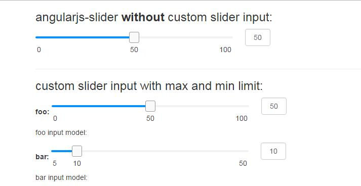

## 简介

项目中经常遇到slider插件需要给用户提供一个可输入数值的输入框，`angularjs-slider`通过输入框输入数值没有限定最大最小值，会导致各种异常场景出现。
`angular-slider-input`就是为这样的使用场景写的简单指令，当操作滑块时，输入框的值会和滑块值保持一致；而当在输入框内输入数值时，失去焦点时会校验数值合法性。


;

## 例子

[demo](http://xunqilong.com/angular-slider-input/)

## 使用

```javascript
    angular.module('yourApp', ['rzModule', 'rx.sliderInput'])
        .controller['$scope', function($scope) {
            $scope.slider = {
                value: 10,
                options: {
                    floor: 0,
                    ceil: 100,
                    minLimit: 0,
                    maxLimit: 100,
                    step: 1,
                    showSelectionBar: true
                }
            };

            $scope.resetSlider = function(value) {
                $scope.slider.value = value;
            };
        }];
```


```html
<!-- angularjs-slider -->
<rzslider class="custom-slider" rz-slider-model="slider.value" rz-slider-options="slider.options"></rzslider>

<!-- angular-slider-input -->
<input type="text" rx-slider-input="slider.value" ng-model="foo" 
     min="slider.minLimit" 
     max="slider.maxLimit"
     step="slider.step"
     on-blur="resetSlider(value)">
```


