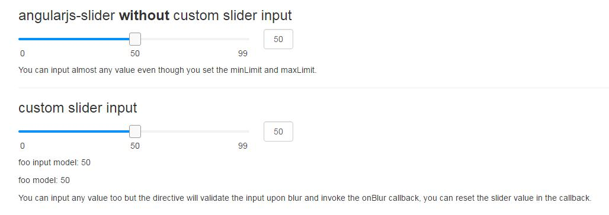

## 简介

项目中经常遇到slider插件需要给用户提供一个可输入数值的输入框，`angularjs-slider`通过输入框输入数值没有限定最大最小值，会导致各种异常场景出现。
`angular-slider-input`就是为这样的使用场景写的简单指令，可以通过滑动条滑动，点击修改绑定数值，也可以在输入框内输入具体数值，当输入数值合法时会通知插件渲染滑块位置。


;

## 例子

[demo](xunqilong.com/angualr-slider-input/index.html)

## 使用

```javascript
    angular.module('yourApp', ['rzModule', 'rx.sliderInput'])
        .controller['$scope', 'EventBus', function($scope, EventBus) {
            $scope.slider = {
                value: 10,
                options: {
                    floor: 0,
                    ceil: 100,
                    step: 1,
                    showSelectionBar: true
                }
            };

            // inform slider plugin to render
            EventBus.on('rx.slider.input.valid', function(e) {
                $scope.slider.value = e.data;
            });
        }];
```


```html
<!-- angularjs-slider -->
<rzslider class="custom-slider" rz-slider-model="slider.value" rz-slider-options="slider.options"></rzslider>

<!-- angular-slider-input -->
<input type="text" rx-slider-input="slider.value" ng-model="foo" slider-id="custom_id" min="slider.floor" max="slider.ceil">

```

## 注意点

- 当输入值合法时会通过EventBus通知slider插件渲染，在失去焦点时会将输入值改为合法值
- 输入框的model不要和slider绑定同一个model，不要依赖输入框的model做其他任何事情
- 暂时只支持非负整数段输入